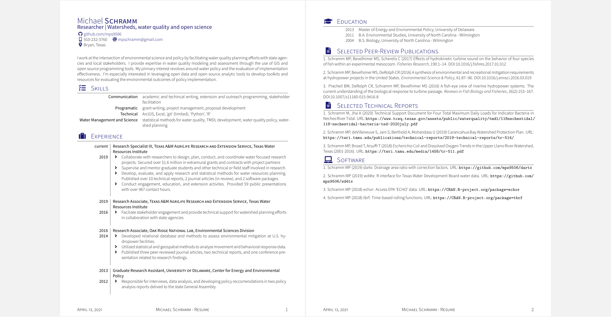
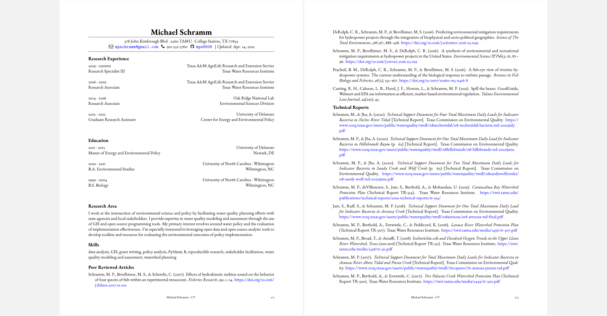

```{r setup, include=FALSE}
knitr::opts_chunk$set(echo = FALSE)
```


This repository contains my resume and CV. R scripts for generating each file are also included. The R script utilizes information maintained in Google Sheets and Zotero reference manager database to help automate document updates. This approach is heavily based on the [datadrivencv](https://github.com/nstrayer/datadrivencv) and [vitae](https://github.com/mitchelloharawild/vitae) packages.

[Resume](https://github.com/mps9506/CV-RMD/raw/master/Resume/Schramm_Resume.pdf)

```{r}

```

[CV](https://github.com/mps9506/CV-RMD/raw/master/CV/CV.pdf)

```{r}

```

